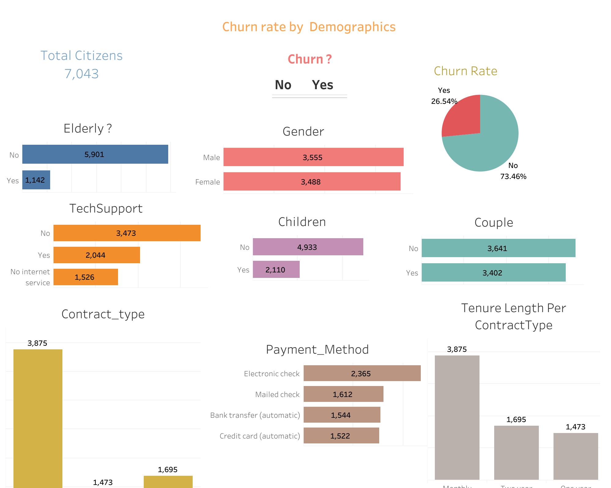
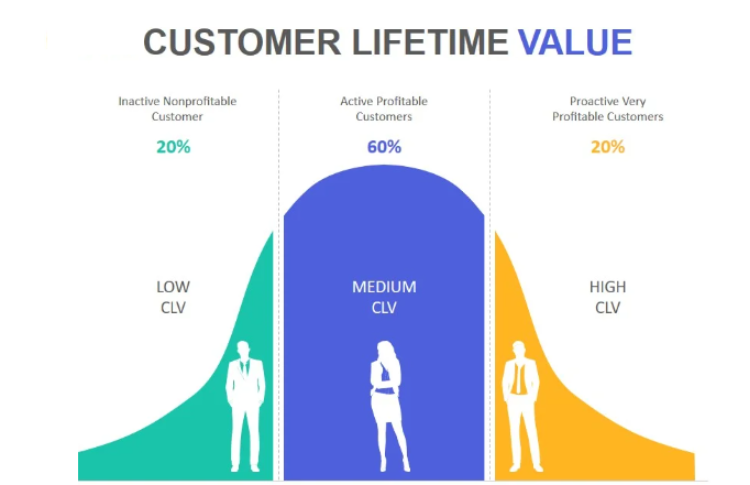
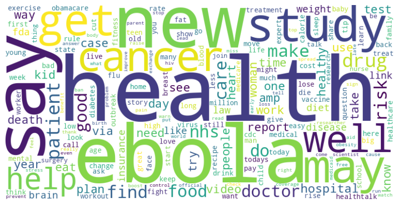
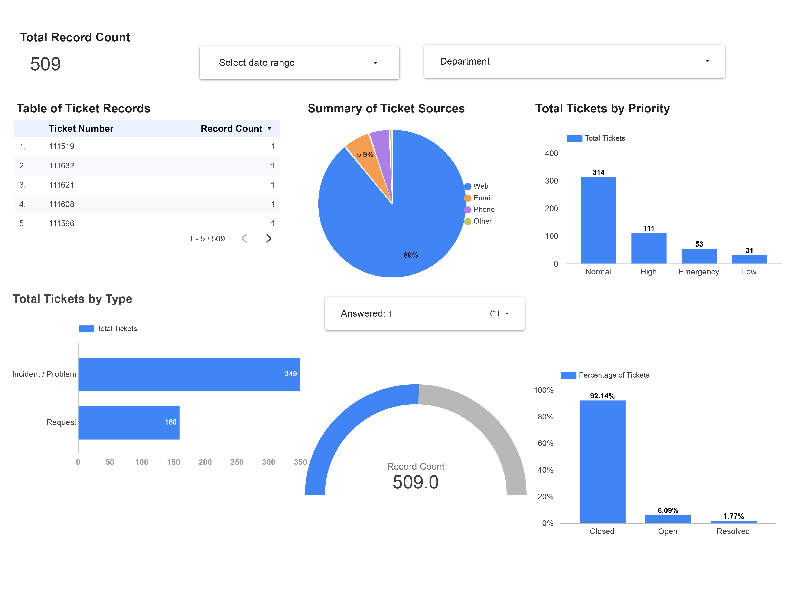
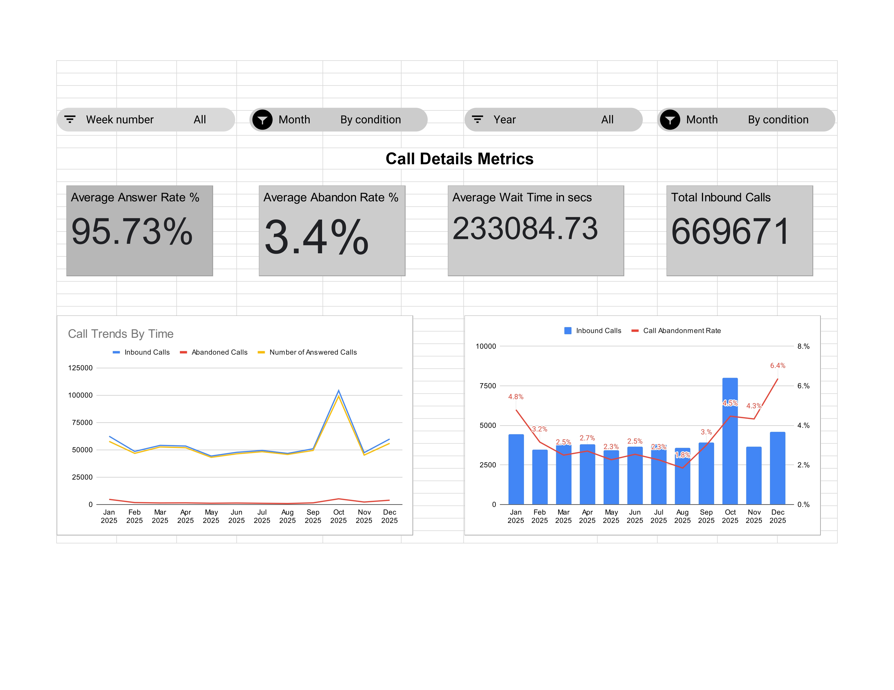
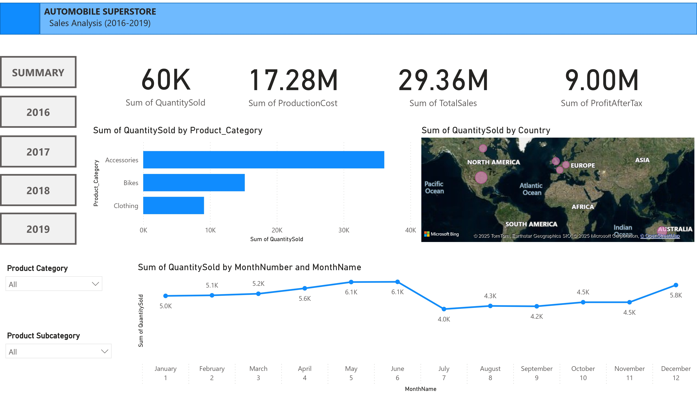
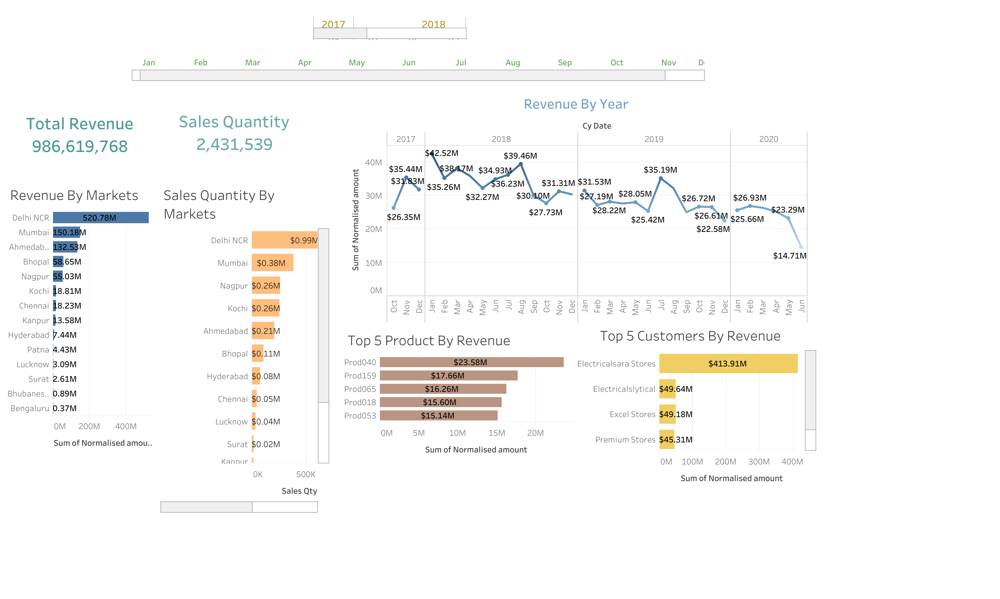

# Customer-Focused Data Scientist
I design predictive models and decision systems that improve retention, customer support, and commercial performance. My recent work includes churn and lifetime value modelling, experimentation, retrieval-augmented AI, and analytics automation.
- Built churn and customer value models to identify high-risk, high-value cohorts for targeted retention
- Reduced customer support response time from 5 minutes to 5 seconds using a RAG-based support assistant
- Improved reporting accuracy by 30% and reduced manual reporting effort by 80% through automated data workflows

#### Technical Skills 
**Core Expertise**: Customer analytics, churn modelling, customer lifetime value (CLV), segmentation, experimentation, statistical inference, retrieval-augmented generation (RAG), predictive modelling, decision frameworks, reporting automation, stakeholder communication

**Machine Learning & Data**:  Python, SQL, R, scikit-learn, LightGBM, Spark, Databricks, FAISS, NLP, model evaluation, feature engineering

**Analytics & BI**
Power BI, Tableau, Looker Studio, Excel, DAX, Power Query

**Cloud & Delivery**
Azure Databricks, Google Cloud Platform, GitHub Actions, CI/CD

## Education
- MSc., Data Science | University of Nottingham
- BEng., Engineering | Federal University of Agriculture, Abeokuta, Nigeria.

## Work Experience
**Data Scientist @ Business Full Spectrum (_Jan 2025 - Present_)**
  
  - Built a customer decision framework combining RFM segmentation, probabilistic models (BG/NBD, Gamma-Gamma), and machine learning (LightGBM) to predict 90-day churn risk and CLV.
  - Achieved ROC-AUC of 0.7654 for churn prediction and developed actionable segments (high-value at risk, loyal, emerging customers).
  - Enabled prioritised retention and marketing strategies based on customer value and risk.
  - Designed and evaluated A/B tests using hypothesis testing (Mann–Whitney U, Chi-Square), validated statistically significant differences between customer groups prior to deployment, increasing confidence in retention interventions, using Python (SciPy), SQL and Power BI.
  - Built and maintained acquisition, activation, engagement and retention dashboards, improving management reporting accuracy by 30% and accelerating actions on at-risk segments, using Power BI (DAX, Power Query), SQL and Python.
  - Designed and evaluated a Retrieval-Augmented Generation customer support bot by reconstructing historical Twitter conversations and grounding LLM responses in agent data, reducing response time from 5 minutes to 5 seconds (98% improvement), using RAG methods, LLM tooling and Twitter data pipelines.
  - Built an OCR and NLP pipeline to classify document pages and extract structured fields (e.g., applicant names, application numbers) from noisy PDFs.
  - Combined rule-based extraction with named entity recognition to improve robustness under OCR noise.
  - Data Governance & Process Automation: Owned the insight/reporting backlog and instituted validation rules and reconciliation checks, achieving a 90% reduction in reporting errors and cutting quarterly manual effort by 80%, using Power Query, Python and SQL.
    
**Data Scientist @ MRS Oil and Gas (_July 2022 – August 2023_)**
  - Delivered operational performance dashboards and trend analyses across regions, contributing to a 20% reduction in unplanned downtime by improving visibility into performance exceptions.
  - Defined reporting metrics, data quality checks, and governance routines that sustained 14 monthly reporting cycles and improved leadership visibility into operational performance.
  - Coordinated cross-functional data inputs and reporting processes, ensuring timely delivery of standardised executive updates and more reliable decision support.
  - Synthesised technical findings into business-facing narratives for non-technical leaders, strengthening the link between analysis and operational decision-making.
  - Standardised reporting templates and workflows to improve consistency, reduce ambiguity, and support scalable performance monitoring.

**Data Scientist @ Hamoye AI Labs  (_Jan 2022 - April 2022_)**
  - Built classification and regression models across structured and unstructured datasets, improving model interpretation accuracy by 25% across project work.
  - Automated reporting and visual outputs for management and compliance use cases, improving repeatability and reducing manual analysis overhead.
  - Improved model input quality through data cleaning and validation pipelines across multiple sources, strengthening downstream model reliability.
  - Produced business-friendly model interpretation artefacts to support stakeholder understanding, handover, and adoption.
  - Supported leadership reviews by translating technical findings into concise decision-ready summaries and presentations.

## Projects
### **Retail Customer Segmentation, CLV & Churn Risk Modelling**

Retail Customer Segmentation, Lifetime Value & Churn Risk Modelling
Built a customer decisioning framework for a non-contractual retail environment where churn is not directly observed. Combined descriptive segmentation, probabilistic CLV modelling, and supervised machine learning to identify which customers were high-value, at risk, or suitable for low-cost nurturing.

**What I built**

RFM-based customer segmentation for lifecycle visibility
BG/NBD and Gamma-Gamma models for expected purchase frequency and spend
LightGBM models to predict 90-day churn risk and 90-day CLV
An action framework combining predicted value and risk into next-best actions such as retention, loyalty, upsell, or nurture

**Key results**

Churn model achieved ROC-AUC = 0.7654
CLV model achieved MAE ≈ 534
Produced decision-ready customer groupings such as High Value | At Risk and High Value | Stable
Shifted analysis from descriptive reporting to prioritised customer action

**Why it matters**
This project shows the ability to connect modelling to commercial decisions, helping retailers allocate retention budget more efficiently and prioritise customers by both risk and expected value.

### **Customer Support Automation with RAG + LLM**
Designed and evaluated a retrieval-augmented support assistant grounded in historical customer service interactions to reduce response latency and improve service consistency.

**What I built**

Reconstructed historical social support conversations into reusable question-answer pairs
Built a retrieval layer using FAISS and embedding-based semantic search
Designed prompts to constrain the LLM to grounded historical responses and avoid fabricated policies or links
Evaluated quality using response similarity, latency measurement, and manual review

**Key results**

Reduced response time from 5 minutes to 5 seconds
Achieved approximately 96–98% improvement in response latency
Introduced guardrails to reduce hallucination risk by restricting outputs to retrieved historical evidence
Preserved human escalation for nuanced or empathy-heavy cases

**Why it matters**
This project demonstrates how to design AI systems for real customer operations: grounded, measurable, and aligned with service quality rather than novelty alone.

### **Customer Churn Dashboard**
[Project Details](https://public.tableau.com/app/profile/helen.soremekun/viz/Tableau_Telco_customer_churn/Churn_Rate_TrendsPatterns?publish=yes)

**Business Goal**
The goal was to measure churn trends and identify which customer segments were driving higher-than-acceptable churn rates.

**What I Did**
I used SQL to calculate churn metrics over 72 months and built a Tableau dashboard to visualise churn by segment, contract type, and behaviour.

**What It Enabled**
This allows stakeholders to quickly identify high-risk segments and prioritise targeted retention strategies.

### Customer Service Response Bot (RAG + LLM for X/Twitter)

[Project Details](https://docs.google.com/presentation/d/1uuZIGD1VnTjzdudm7wDMjz-Sf3yp5EUSyZGq9cq0nLQ/edit?usp=sharing)

### **Key Information Extraction from Planning PDFs**

**Document Classification & Information Extraction from Historical Planning Records**
Built a document processing pipeline to classify scanned planning notice pages and extract structured fields such as applicant names and application numbers from noisy multi-page PDFs.

**What I built**

OCR-based text extraction pipeline for scanned pages using PaddleOCR
Zero-shot page classification using a BART MNLI model
Hybrid field extraction combining regular expressions and SpaCy named entity recognition
Error handling for OCR noise and false matches, especially where application numbers resembled dates

**Why it matters**
This project shows practical NLP capability on messy real-world documents, not just clean benchmark data. It demonstrates applied document intelligence, pipeline thinking, and an understanding of extraction reliability under noisy conditions.

### **Healthcare Tweet Sentiment Classification**
[Project Details](https://github.com/helen-oy/Big-Data-Analytics-projects)

**Business Goal**
“The goal was to automatically classify large volumes of unstructured text into meaningful topics to understand public sentiment at scale.”

**What I Did**
“I used Spark SQL and Spark ML to process high-volume tweet data and built a multinomial Naive Bayes model, comparing local modelling with a global self-supervised learning approach.”

**What It Enabled**
“This enables organisations to automatically monitor customer or public feedback, identify key themes, and prioritise response strategies at scale.”

## Projects - Data Analytics

### Helpdesk Ticket Status Report
[Project Details](https://lookerstudio.google.com/reporting/2b302444-1d67-4be8-a9e2-ae1bdabfb073)

**Business Goal**
The goal was to monitor support team performance and identify process improvements to reduce ticket backlog.

**What I Did**
I built an interactive Looker Studio dashboard tracking ticket trends, resolution patterns, and departmental workload.

**What It Enabled**
This helped identify where new hires and self-service options could reduce workload and improve response time.

### Contact Centre KPI metrics Reporting
[Project Details](https://docs.google.com/spreadsheets/d/1C1dyJY6WyH9LOfsDYhYvVm60t2eqBTHzQCTRJGB4S2M/edit?gid=34913950#gid=34913950)

**Business Goal**
The goal was to monitor call centre performance and workforce efficiency using KPI metrics.

**What I Did**
I built a reporting dashboard in Google Sheets tracking answer rate, abandon rate, and call trends over time.

**What It Enabled**
This helped management understand peak periods, reduce abandon rates, and optimise staffing.

### Automobile Sales Analysis Report
[Project Details](https://app.powerbi.com/view?r=eyJrIjoiMjc4YzFmOTMtMTY2MC00YTYyLTlhNTMtNWFmOGEwMGJjMmQwIiwidCI6ImNlZWI4M2FiLTMzOTItNGViYy05ZWYxLTNmYTc2YmYzYzI0MiJ9
 )
 
**Business Goal**
The goal was to analyse sales performance, profitability, and product trends across regions.

**What I Did**
I used SQL, DAX, and Power BI to build dashboards tracking revenue, profit, product performance, and regional trends over multiple years.

**What It Enabled**
This allowed leadership to identify top-performing products, profitable regions, and yearly performance patterns.

### Superstore Sales Insights Dashboard
[Project Details](https://public.tableau.com/app/profile/helen.soremekun/viz/tableauproject_sales_insight/Dashboard1?publish=yes)

**Business Goal**
The goal was to translate large transactional data into clear sales and customer insights for decision-making.

**What I Did**
I connected Tableau to a MySQL database and built dashboards showing KPIs, customer revenue contribution, and regional sales trends.

**What It Enabled**
This helped management quickly identify key revenue drivers and customer segments contributing most to sales.

### Count-based Analysis of Pet breeds 
**Business Goal**
The goal was to understand how product characteristics influenced sales performance.

**What I Did**
I used Excel pivot tables and lookup functions to analyse breed characteristics, pricing, and quantity sold.

**What It Enabled**
This informed which breeds to prioritise for stocking based on revenue potential rather than popularity.

