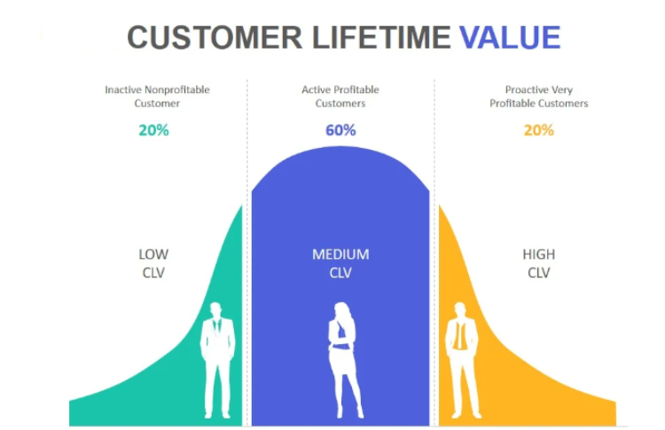
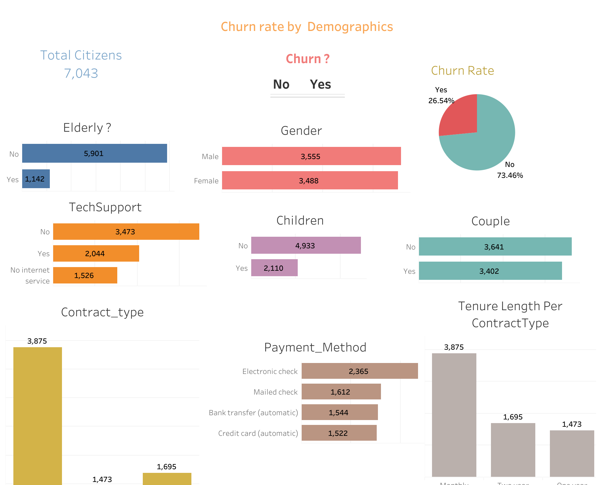

# Data Scientist

#### Technical Skills 
**Data Science**: Python, SQL, R, Machine Learning, Azure Databricks, Google Cloud Platform (GCP), CI/CD, Github Actions.

**Analytics**:  PowerBI, Tableau, Microsoft Excel, Azure Data Studio, Looker.

## Education
- MSc., Data Science | University of Nottingham
- BEng., Engineering | Federal University of Agriculture, Abeokuta, Nigeria.

## Work Experience
**Data Scientist @ Business Full Spectrum (_Jan 2025 - Present_)**
  
  - Predictive Analytics & Churn Modeling: Built and trained a machine-learning churn model across behavioural features, achieving 95.7% prediction accuracy and enabling identification of high-risk cohorts for a targeted 10% churn reduction strategy, using Python (scikit-learn), SQL and Databricks.
  - Experimentation & Statistical Validation: Designed and evaluated A/B tests using hypothesis testing (Mann–Whitney U, Chi-Square), validated statistically significant differences between customer groups prior to deployment, increasing confidence in retention interventions, using Python (SciPy), SQL and Power BI.
  - Business Intelligence & Reporting Accuracy: Built and maintained acquisition, activation, engagement and retention dashboards, improving management reporting accuracy by 30% and accelerating actions on at-risk segments, using Power BI (DAX, Power Query), SQL and Python.
  - RAG Prototype & Support Automation: Designed and evaluated a Retrieval-Augmented Generation customer support bot by reconstructing historical Twitter conversations and grounding LLM responses in agent data, reducing response time from 5 minutes to 5 seconds (98% improvement), using RAG methods, LLM tooling and Twitter data pipelines.
  - Data Governance & Process Automation: Owned the insight/reporting backlog and instituted validation rules and reconciliation checks, achieving a 90% reduction in reporting errors and cutting quarterly manual effort by 80%, using Power Query, Python and SQL.
    
**Project Analyst @ MRS Oil and Gas (_July 2022 – August 2023_)**
  - Operational Analytics & Downtime Reduction: Delivered performance dashboards and led trend and variance analysis across regions, contributing to a 20% reduction in unplanned downtime, using Power BI, SQL and Azure Data Studio.
  - Data Quality Monitoring & Metrics Definition: Defined success metrics and instituted data quality monitoring, sustaining a monthly reporting cadence of 14 reports during the engagement and improving leadership visibility, using SQL, Power BI and documentation.
  - Cross-Functional Coordination & Data Flow: Coordinated inputs across teams to keep data flows accurate and consistent, ensuring timely delivery of 14 scheduled regional reports and stakeholder updates, using SQL, Azure Data Studio and stakeholder communication templates.
  - Stakeholder Communication & Insight Translation: Conveyed analysis and trend findings to non-technical stakeholders through concise executive updates, delivering 14 monthly executive summaries to support decision-making, using Power BI, Excel and presentation materials.
  - Process Oversight & Reporting Governance: Owned reporting cycles and stakeholder updates, standardising templates and delivery processes which sustained consistent reporting frequency over 14 months, using Power BI, SQL and reporting governance documentation.

**Data Scientist @ Hamoye AI Labs  (_Jan 2022 - April 2022_)**
  - Model Development & Predictive Performance: Built classification and regression models on structured and unstructured datasets, improving interpretation accuracy by 25% across projects, using Python (scikit-learn), R and SQL.
  - Reporting Automation & Compliance: Produced visualisations and automated reports for management and compliance reviews, delivering 4 automated reports during the engagement, using Python, Power BI and R.
  - Data Cleansing & Validation: Enforced cleansing and validation across multiple sources to improve input quality for models, reducing data-related issues in pipelines across the engagement period, using Python (pandas), SQL and validation scripts.
  - Technical Simplification & Stakeholder Support: Simplified technical outputs for business leaders and supported presentation materials and Q&A, contributing to clearer decision-making in 4 management review cycles, using Power BI, Python and slide decks.
  - Model Interpretation & Explainability: Enhanced model interpretability and documentation to support operational handover, producing model explanation artefacts for 4 projects and using SHAP-style techniques, Python and R.

## Projects - Data Science
### Customer Service Response Bot (RAG + LLM for X/Twitter)

[Project Details](https://docs.google.com/presentation/d/1uuZIGD1VnTjzdudm7wDMjz-Sf3yp5EUSyZGq9cq0nLQ/edit?usp=sharing)

**Business Goal**
The goal was to reduce customer response time and agent workload by automating replies to routine support queries on social media while maintaining high response quality.

**What I Did**
I cleaned and reconstructed historical tweet conversations into Q→A pairs, built a retrieval pipeline using FAISS, and integrated a RAG architecture with an LLM to generate responses grounded in real past interactions. I also created lexical filters to distinguish true unresolved cases from customer closure messages and designed evaluation metrics based on latency and response similarity.

**What It Enabled**
This enables near-instant, consistent responses to common customer queries, reduces false identification of unresolved tickets, and allows human agents to focus only on complex issues requiring empathy, with a ~96% reduction in response time.

### Customer Lifetime Prediction and Churn Analysis
[Project Details](https://github.com/helen-oy/Customer_Lifetime_Value_ML_Model)

**Business Goal**
The goal was to improve customer retention and marketing efficiency by identifying high-value customers and churn risk.

**What I Did**
I used SQL and Python to perform RFM and cohort analysis, then built predictive CLV and churn models using XGBoost on over 600,000 customer records.

**What It Enabled**
This supports targeted retention strategies focused on high-value, high-risk customers and better allocation of marketing spend.

### Customer Churn Dashboard
[Project Details](https://public.tableau.com/app/profile/helen.soremekun/viz/Tableau_Telco_customer_churn/Churn_Rate_TrendsPatterns?publish=yes)

**Business Goal**
The goal was to measure churn trends and identify which customer segments were driving higher-than-acceptable churn rates.

**What I Did**
I used SQL to calculate churn metrics over 72 months and built a Tableau dashboard to visualise churn by segment, contract type, and behaviour.

**What It Enabled**
This allows stakeholders to quickly identify high-risk segments and prioritise targeted retention strategies.

### Healthcare Tweet Sentiment Classification
[Project Details](https://github.com/helen-oy/Big-Data-Analytics-projects)

**Business Goal**
“The goal was to automatically classify large volumes of unstructured text into meaningful topics to understand public sentiment at scale.”

**What I Did**
“I used Spark SQL and Spark ML to process high-volume tweet data and built a multinomial Naive Bayes model, comparing local modelling with a global self-supervised learning approach.”

**What It Enabled**
“This enables organisations to automatically monitor customer or public feedback, identify key themes, and prioritise response strategies at scale.”

### Bus Arrival Time Prediction
[Project Details](https://github.com/helen-oy/Transport-Data-Analysis-Big-data-project-)

**Business Goal**
The goal was to predict service delays and understand patterns affecting transport reliability.

**What I Did**
I used K-means clustering to segment travel patterns and trained an ANN model to classify delay levels using historical bus movement data.

**What It Enabled**
This allows transport operators to adjust scheduling and resources to improve reliability during peak congestion periods.

## Projects - Data Analytics

### Helpdesk Ticket Status Report
[Project Details](https://lookerstudio.google.com/reporting/2b302444-1d67-4be8-a9e2-ae1bdabfb073)

**Business Goal**
The goal was to monitor support team performance and identify process improvements to reduce ticket backlog.

**What I Did**
I built an interactive Looker Studio dashboard tracking ticket trends, resolution patterns, and departmental workload.

**What It Enabled**
This helped identify where new hires and self-service options could reduce workload and improve response time.

### Contact Centre KPI metrics Reporting
[Project Details](https://docs.google.com/spreadsheets/d/1C1dyJY6WyH9LOfsDYhYvVm60t2eqBTHzQCTRJGB4S2M/edit?gid=34913950#gid=34913950)

**Business Goal**
The goal was to monitor call centre performance and workforce efficiency using KPI metrics.

**What I Did**
I built a reporting dashboard in Google Sheets tracking answer rate, abandon rate, and call trends over time.

**What It Enabled**
This helped management understand peak periods, reduce abandon rates, and optimise staffing.

### Automobile Sales Analysis Report
[Project Details](https://app.powerbi.com/view?r=eyJrIjoiMjc4YzFmOTMtMTY2MC00YTYyLTlhNTMtNWFmOGEwMGJjMmQwIiwidCI6ImNlZWI4M2FiLTMzOTItNGViYy05ZWYxLTNmYTc2YmYzYzI0MiJ9
 )
 
**Business Goal**
The goal was to analyse sales performance, profitability, and product trends across regions.

**What I Did**
I used SQL, DAX, and Power BI to build dashboards tracking revenue, profit, product performance, and regional trends over multiple years.

**What It Enabled**
This allowed leadership to identify top-performing products, profitable regions, and yearly performance patterns.

### Superstore Sales Insights Dashboard
[Project Details](https://public.tableau.com/app/profile/helen.soremekun/viz/tableauproject_sales_insight/Dashboard1?publish=yes)

**Business Goal**
The goal was to translate large transactional data into clear sales and customer insights for decision-making.

**What I Did**
I connected Tableau to a MySQL database and built dashboards showing KPIs, customer revenue contribution, and regional sales trends.

**What It Enabled**
This helped management quickly identify key revenue drivers and customer segments contributing most to sales.

### Count-based Analysis of Pet breeds 
**Business Goal**
The goal was to understand how product characteristics influenced sales performance.

**What I Did**
I used Excel pivot tables and lookup functions to analyse breed characteristics, pricing, and quantity sold.

**What It Enabled**
This informed which breeds to prioritise for stocking based on revenue potential rather than popularity.

