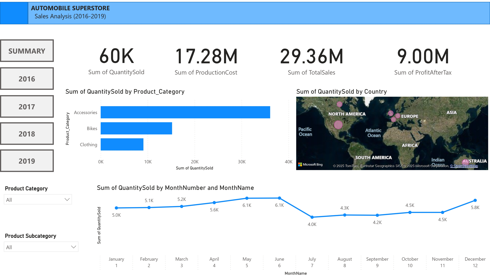

<!-- Google Tag Manager -->

<!-- End Google Tag Manager -->

<!-- Google Tag Manager (noscript) -->
<noscript><iframe src="https://www.googletagmanager.com/ns.html?id=GTM-5NRLH7Z9"
height="0" width="0" style="display:none;visibility:hidden"></iframe></noscript>
<!-- End Google Tag Manager (noscript) -->

# Data Scientist

#### Technical Skills 
**Data Science**: Python, SQL, R, Spark, Machine Learning, Azure Databricks, Google Cloud Platform (GCP), CI/CD, Github Actions.

**Analytics**: Microsoft Fabric, Excel, Git, Azure Data Studio, PowerBI, Tableau, Looker, SSMS, MySQL, ETL, Data Modelling.

## Education
- MSc., Data Science | University of Nottingham
- BEng., Engineering | Federal University of Agriculture, Abeokuta, Nigeria.

## Work Experience
**Data Analyst @ Business Full Spectrum (_Jan 2024 - Present_)**
  - Conducted exploratory data analysis on 540,000+ help desk tickets, identifying patterns and trends such as unresolved complaints by department, and visualizing the distribution of resolved, open, and overdue tickets.
  - Designed and deployed dashboards using Tableau and Power BI to track average resolution time by department and analyzed agent workload based on ticket thread counts, improving resource allocation by 20%.
    
**Project Analyst @ MRS Oil and Gas (_July 2022 – August 2023_)**
  - Conducted data analysis of external servicing records for retail stations across 36 regions.
  - Identified cost-saving opportunities through data-driven analysis, contributing to a 15% reduction in project expenses. 

**Data Scientist @ Hamoye AI Labs  (_Jan 2022 - April 2022_)**
  - Analyzed over 100,000 data points to visualize climate trends and derive actionable insights from unstructured FAO datasets.
  - Built and validated machine learning models with up to 90% accuracy, forecasting ecological footprints and energy consumption. 

## Projects - Data Science

### Healthcare Tweet Sentiment Classification
[Project Details](https://github.com/helen-oy/Big-Data-Analytics-projects)

Led a 4-member team to build a big data solution to classify originally 
unlabelled text from tweets to different topics. This data-driven approach leveraging **Spark SQL**, **Spark ML** libraries and Multinomial Naive Bayes models in global self-supervised learning and pure local approach led to better identify the approach that outperformed the more commonly used local approach and obtain underlying key topics in health-related tweets. The proposed global self-supervised learning achieved 80% Multilabel Accuracy and a big data scalable design solution.

### Bus Arrival Time Prediction
[Project Details](https://github.com/helen-oy/Transport-Data-Analysis-Big-data-project-)

Used Artificial Neural Network combined with k-means clustering for predicting bus arrival times for Department of Transports’ Bus Open Data Service, United- Kingdom. Applied K-means clustering to segment travel times and trained ANN models to classify travel times into delay categories: 
zero, low, moderate, and high. This approach led to better identify temporal trends, such as peak delays during weekday mornings and minimal delays in off-peak hours. The results contributes to improving the public transport systems by offering more reliable arrival time predictions.

### Customer Lifetime Prediction and Churn Analysis
[Project Details](https://github.com/helen-oy/Customer_Lifetime_Value_ML_Model)

Deployed Machine learning model to predict customer lifetime value segment on **Google Cloud**. Used Revenue, Frequency, Monetary Value Analysis with  **Python** to predict lifetime value within a 6-month window for over 600,000 customer records. Predicted churn rate of 3000+ customers, identified high-risk churn segments using **Xgboost** model and  achieved 92% prediction accuracy. Diagnosed and mitigated overfitting caused by class imbalance in revenue distribution using model simplification.

 [Link to deployed model]()

## Projects - Data Analytics

### Helpdesk Ticket Status Report
[Project Details](https://lookerstudio.google.com/reporting/2b302444-1d67-4be8-a9e2-ae1bdabfb073)

Designed an interactive dashboard that shows performance of the helpdesk support team in handing incidence and requests tickets using **Google Looker Studio**. Identified areas for improvements by departments, needs for new hires and recommended introduction of self service options to reduce workload and improve ticket processing speed.

### Customer Churn Dashboard
[Project Details](https://public.tableau.com/app/profile/helen.soremekun/viz/Tableau_Telco_customer_churn/Churn_Rate_TrendsPatterns?publish=yes)

An ideal churn rate is 5-7% per year, depending on if you measure customers or revenue. The churn rate in this project was calculated overall, for a period of 72 months (3 years) based on the data set fields: customer segments, service types, monthly charges, payment methods, tech support, streaming services and contract type using **SQL queries** and **Tableau** for visualization. In the period of three years, churn rate was 26.54%, with with a 1.8% per year churn rate increase above an ideal 7% upper band churn rate.

### Contact Centre KPI metrics Reporting
[Project Details](https://docs.google.com/spreadsheets/d/1C1dyJY6WyH9LOfsDYhYvVm60t2eqBTHzQCTRJGB4S2M/edit?gid=34913950#gid=34913950)

Created a dashboard to report weekly, monthly, and yearly KPI metrics such as average answer rate, average abandon rate, and call trends for a Call Centre to support workflow and workforce and management using **Google sheets**. Identified that call center 3.4% Average Abandon Rate from 669, 671 Inbound calls and peak calls occuring in October.

### Automobile Sales Analysis Report
[Project Details](https://app.powerbi.com/view?r=eyJrIjoiMjc4YzFmOTMtMTY2MC00YTYyLTlhNTMtNWFmOGEwMGJjMmQwIiwidCI6ImNlZWI4M2FiLTMzOTItNGViYy05ZWYxLTNmYTc2YmYzYzI0MiJ9
 )
 
Designed an Interactive Dashboard using **Power BI**, **DAX queries** and **SQL** **scripts** to obtain monthly and yearly sales key performance indicators such as total revenue, total sales, top-performing products, top-performing products subcategories, production costs, profit after tax and products performance by country between 2016 to 2019. In 2018, the highest sales and profits were recorded and North Americ yield the most profit from the 7 continents.

### Superstore Sales Insights Dashboard
[Project Details](https://public.tableau.com/app/profile/helen.soremekun/viz/tableauproject_sales_insight/Dashboard1?publish=yes)

Created an Interactive dashboard and interpreted 150,000+  transactional data into a user-friendly interface, providing the managing director with key insights using **Tableau desktop** connected to **MySQL** server .Presented key performance indicators (KPIs) such as total revenue, total sales, top-performing products, customer demographics, and sales trends with simple and clear visualizations. Delhi NCR region generated the most revenue and the customer with the most revenue "Electricalsara Store", generated over 40% of the total revenue in 2018. 

### Count-based Analysis of Pet breeds 
Using **Excel** functions like pivot tables, slicers, vlookups, xlookups, pivot charts, created a summary of the count-based analysis of cat and dog breeds based on their different subgroups such as weight, physical characteristics, temperament, price, and average sales. Identified that Quantity sold is independent of the popularity of dog and cat breeds. High/less-popular breeds have almost the same quantity sold. In the selection of top breeds to stock up are Turkish van, American shorthair, LaPerm and Persian cats promises to yield the most revenue, based on average price and quantity sold.
 

